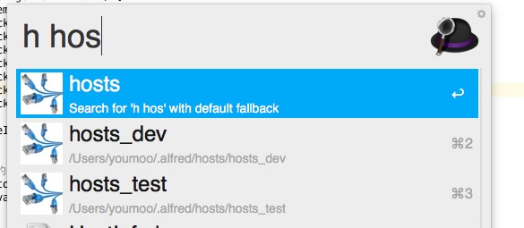

An alfred workflow that makes it easy to switch your hosts.
=====

[中文说明](http://xiaoyuan.life/2015/12/25/alfred-hosts-switcher/)

This workflow will create 2 dirs in your home dir:

1. *~/.alfred/hosts/* where you put various hosts files
2. *~/.alfred/hosts/backup* where the workflow keep hosts history.

### Usage

After installing, two keywords can be used:

1. `h+space` : List all hosts files in *~/.alfred/hosts/* dir for you to switch.
2. `hf` Open *~/.alfred/hosts/* dir in mac finder.

